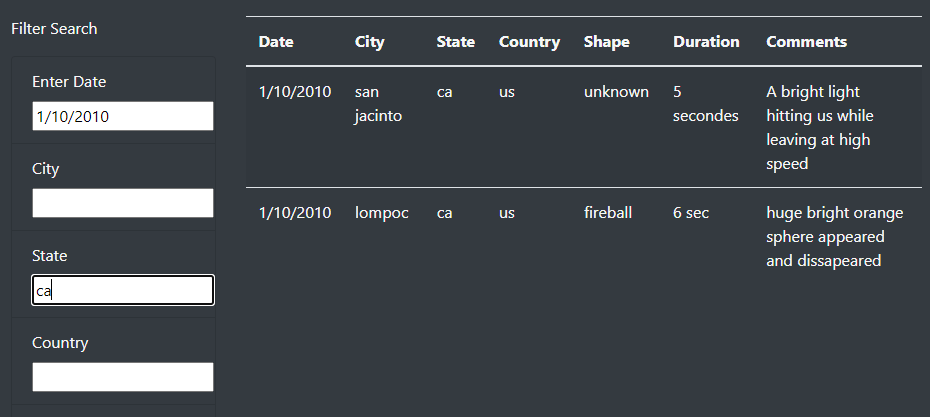

# The Truth is Out There

## Overview
The purpose of the analysis is to create a webpage with a dynamic table allowing users to filter UFO data across multiple criteria at the same time.  Specifically, the site should be able to filter data on date, city, state, country and shape.

### Resources
- data.js
- VS Code
- html, javaScript

## Results

### Search Filters
As an example, if a user wanted to filter the UFO data to include only events occuring on 1/10/2010 in the state of california, the table would display only those two events.

### Summary
The main drawback of this webpage is the limited included data from the data.js file.  For example, there are no events recorded in roswell, and data within the last several years is also not included.  

If the webpage were developed further, I would recommend:
- Including all relevant data - possibly by pulling from a larger database.
- Include other UFO information, perhaps links to other websites, or articles scraped from other sites.
- Include a discussion area where people could post their own UFO stories and corroborate experiences.
